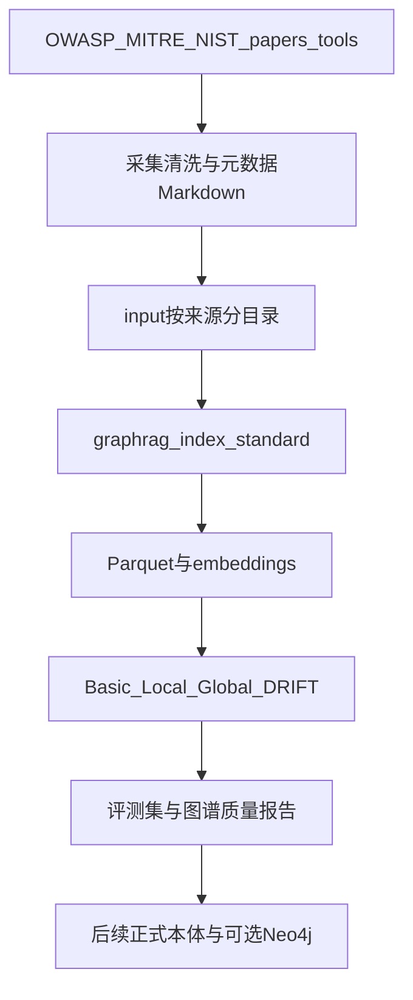

# 大模型安全防御 GraphRAG 知识库（第一版）

## 决策（已锁定）

- **项目位置**：以当前仓库根目录 [`SAADS-Red-team`](C:\Users\Administrator\Desktop\@Projects\SAADS-Red-team) 为 GraphRAG 工程根（对应你草稿中的 `llm-defense-graphrag/` 树，不嵌套多余一层）。
- **与旁系关系**：全新实现；可参考 [`LLM-Security-GraphRAG`](C:\Users\Administrator\Desktop\@Projects\LLM-Security-GraphRAG) 的 Prompt 结构、配置分层、质量检查思路，**不 import / 不拷贝其 runner 代码**。
- **语料规模**：首批 **100–300** 篇高质量文档（权威框架 + 工具文档 + 精选论文/报告）。
- **索引方法**：仅 `standard`；Fast 留作后续对照。
- **存储**：第一版只用 GraphRAG 默认 Parquet + 向量存储；**不上 Neo4j、不设计正式本体**。
- **模型**：`.env` 配置 OpenAI 兼容端点（`GRAPHRAG_API_KEY` / 或 `OPENAI_*` 映射到 settings）；具体密钥由你本地填写。

## 目标架构



## 目录与脚手架

```text
SAADS-Red-team/
├── input/{owasp,mitre,nist,papers,tools,incidents,vendor_reports}/
├── prompts/                  # prompt-tune 产物 + 人工修订
├── output/                   # entities/relationships/... parquet
├── cache/
├── reports/                  # 质量统计、评测结果
├── eval/questions.yaml       # 30–50 题，按 method 分组
├── scripts/                  # 采集辅助、质量统计（自写，轻量）
├── .env
├── settings.yaml
├── pyproject.toml            # uv + graphrag，Python 3.12
└── README.md
```

初始化命令（实施阶段执行）：

```powershell
uv init
uv python pin 3.12
uv add graphrag
uv run graphrag init
uv run graphrag index --dry-run
```

## 阶段 1：语料采集与文档格式（100–300）

**优先清单（种子覆盖，再扩量）：**

| 类别 | 来源 |
|------|------|
| 权威框架 | OWASP LLM Top 10、OWASP Agentic、MITRE ATLAS、NIST AI RMF / GenAI Profile / AML Taxonomy |
| 工具 | PyRIT、garak、PurpleLlama/CyberSecEval、NeMo Guardrails、Guardrails AI、Llama Guard、Prompt Guard |
| 论文主题 | Prompt Injection / Jailbreak / RAG Poisoning / Agent Tool / Memory Poisoning / Leakage / Extraction / Inversion / Guardrail Eval / Red Teaming |

**单篇格式**：PDF/HTML/DOCX 先转 Markdown/纯文本；正文前固定元数据头，并在 `settings.yaml` 开启元数据复制到每个 text unit（GraphRAG 原生能力），字段至少：

`title`, `source`, `source_type`, `published_at`, `security_domain`, `trust_level`, `canonical_url`, `document_version`

维护一份 [`reports/corpus_manifest.csv`](reports/corpus_manifest.csv)（路径、来源、领域、信任等级、字数），便于审计与扩量。

## 阶段 2：最小实体类型与配置

在 [`settings.yaml`](settings.yaml) 的 `extract_graph` 固定七类（不做自动发现覆盖）：

```yaml
extract_graph:
  entity_types:
    - ATTACK_TECHNIQUE
    - DEFENSE_CONTROL
    - COMPONENT
    - VULNERABILITY
    - TOOL
    - STANDARD
    - EVALUATION
extract_claims:
  enabled: false   # 第二轮再开
```

明确**不**在第一版加入 COUNTRY/PERSON/ORGANIZATION/DATE/METRIC 等易稀释类型。

## 阶段 3：领域 Prompt（tune + 人工钉死）

1. 语料入库后运行：

```powershell
uv run graphrag prompt-tune `
  --domain "large language model application security and defensive controls" `
  --language Chinese `
  --no-discover-entity-types
```

2. 人工修订 `prompts/extract_graph.txt`（思路借鉴旁系，语义按本项目七类重写），强制：
   - 七类定义清晰（如 PyRIT → TOOL/EVALUATION，OWASP → STANDARD，Defense 文案不得标成 ATTACK）
   - 关系描述必须带方向与语义（缓解/利用/针对/实现/推荐/评估/限制）
   - 第一版关系**不强制封闭谓词表**（交给 GraphRAG 开放抽取；正式本体阶段再归一化）

3. 同步检查 summarize / community report prompt 是否过偏情报 CVE 风格；改为防御知识库语气。

## 阶段 4：Standard 索引

```powershell
uv run graphrag index --method standard
```

验收产物：`documents` / `text_units` / `entities` / `relationships` / `communities` / `community_reports`（及可选 covariates）parquet + embeddings。必要时导出 GraphML 快照便于可视化，仍不接 Neo4j。

## 阶段 5：评测集与四模式路由

在 [`eval/questions.yaml`](eval/questions.yaml) 准备 **30–50** 题，四组各若干：

| Method | 题型示例 |
|--------|----------|
| basic | OWASP 如何定义 Prompt Injection？ |
| local | 哪些措施可缓解 RAG Poisoning？ |
| global | 大模型应用防御体系可分哪些层？ |
| drift | 浏览器+代码执行+长期记忆的 Agent 如何纵深防御？ |

默认路由：定义/原文 → Basic；具体攻防实体 → Local；领域全景 → Global；跨组件方案 → DRIFT。

手工或轻量脚本记录：答案是否引用原文、攻击/防御是否混淆、关系方向错误等；重点错误优先改 Prompt，不急着上本体。

## 阶段 6：图谱质量分析（为正式本体铺路）

用 [`scripts/analyze_graph.py`](scripts/analyze_graph.py)（自写）读取 parquet，输出到 `reports/`：

- 各实体类型数量、重复/同义词候选
- 高频关系表述、方向异常样本
- 节点度分布、孤立节点比例
- 社区主题摘要是否合理
- 攻击—防御路径覆盖粗检

**第二轮**再开启 `extract_claims`（效力、限制、绕过、延迟、适用条件等），Claim 结果并入统计。

## 明确不做（第一版）

- 正式本体类/谓词封闭集（MITIGATES 等）——等有真实统计后再定
- Neo4j 部署与导入
- FastGraphRAG 作为主路径
- 依赖或 fork `LLM-Security-GraphRAG` 代码

## 实施顺序（交付检查点）

1. uv + graphrag 脚手架与 `.env` / `settings.yaml` 骨架
2. 语料采集转换 + manifest 达到 ≥100 篇
3. prompt-tune + 七类 Prompt 定稿；claims 关闭
4. standard 全量索引跑通
5. 四模式冒烟查询 + 30–50 题评测记录
6. parquet 质量报告；文档化「下一版本体/Claim/Neo4j」入口
