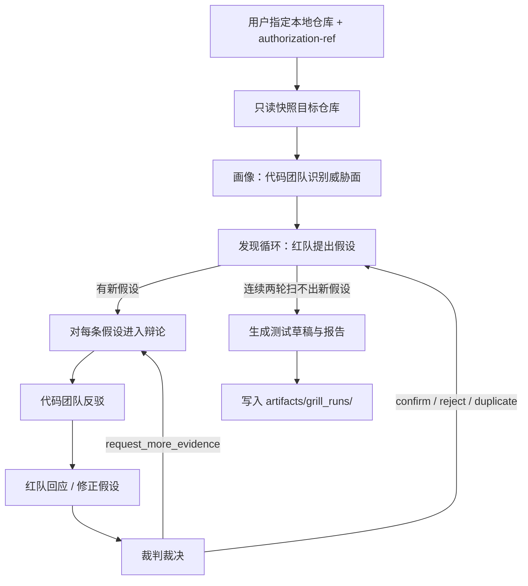

# SAADS-Red-team

面向大模型应用安全的红队研究平台：用可审计的安全知识图谱做证据底座，再在其上生成离线攻击案例、并对授权的本地 LLM 应用仓库做多智能体对抗审计。

它不是通用爬虫，也不是自动替代安全专家的决策引擎。图谱回答与审计结论都要求可追溯证据，并在发布前保留人工审阅空间。

## 实现了什么

项目由三层能力组成：

| 能力 | 包 / 入口 | 作用 |
|---|---|---|
| 安全知识图谱 | `llm_defense_graphrag` + GraphRAG 索引 | 从权威 LLM 安全资料构建可按关系检索的知识底座 |
| 离线攻击案例生成 | `saads_attack_agent` | 用自然语言描述测试意图，产出有图谱证据支撑的攻击案例与离线模拟脚本 |
| 对抗式仓库审计 | `saads_grill_agent` | 对明确授权的本地仓库做只读、多智能体红蓝对抗审查 |

### 1. LLM 安全知识图谱

从 MITRE ATLAS、OWASP LLM Top 10、Microsoft PyRIT、NVIDIA garak 等权威来源构建 Microsoft GraphRAG 索引，连接攻击技术、弱点、系统组件、防御控制、评估工具与标准。

支持 Basic / Local / Global / DRIFT 四类查询：定位原文事实、分析实体邻域、归纳全局主题、做多跳路径探索。实体抽取后有对齐与审计，查询结果可回到图谱数据引用。

### 2. 离线攻击案例智能体（`saads_attack_agent`）

用自由文本描述测试需求，智能体经 GraphRAG  grounding 后生成：

- `attack_case.json`：结构化、可审计的攻击案例
- `attack.py`：只操作内置模拟目标的离线 Python 脚本

当前支持三类攻击族：`prompt_injection`、`long_horizon_dialogue`、`tool_hijack`。不支持的意图直接拒绝，不生成文件。不连接、不探测、不攻击真实环境。

### 3. 对抗式仓库审计（`saads_grill_agent`）

对**明确授权的本地** LLM 应用仓库做只读审查：红队提出漏洞假设，代码团队反驳，独立裁判裁决。双方只能引用已签发的代码证据或 GraphRAG 证据；生成的回归测试草稿只写入评估产物目录，不写入目标仓库、不自动执行。

目标仓库始终视为不可信数据：不加载其 Skills / MCP / hooks 作为指令，也不连接目标模型、部署环境或外部网络。

## 技术框架

| 层级 | 技术 |
|---|---|
| 语言与包管理 | Python 3.12、`uv` |
| 知识图谱 | Microsoft GraphRAG 3.1.1、LanceDB、Parquet |
| 图谱模型 | GLM `glm-4.5-air`（抽取 / 对齐 / 查询）、智谱 `embedding-3`（向量） |
| 智能体运行时 | Claude Agent SDK（经 DeepSeek Anthropic-compatible 接口） |
| 数据契约 | Pydantic 2 |
| 领域 Skills | 项目级 `.claude/skills/`（意图识别、案例 grounding、离线脚本规划等） |
| 测试 | pytest |

## 智能体设计框架

两条智能体链路都跑在 Claude Agent SDK 上，但分工不同：攻击案例智能体是**两阶段单线流水线**；仓库审计（grill）是**三角色 + 确定性状态机**驱动的对抗循环。

### 攻击案例智能体：两阶段 grounding

```text
自由文本请求
  → 阶段 1：意图识别（recognize-attack-intent + GraphRAG）
  → 不支持则退出
  → 阶段 2：案例 grounding + 离线脚本计划（Skills + GraphRAG）
  → Pydantic / 证据审计校验
  → 确定性渲染 attack_case.json + attack.py
```

模型不能写任意脚本、不能访问网络或真实目标；只能通过只读 GraphRAG MCP 取证，最终脚本由本地模板渲染。

### 仓库审计智能体：指定目录后如何不断 grill

用户指定本地目标目录并提供 `--authorization-ref` 后，系统不会让两个 Agent「自由聊天」，而是由 Python 状态机按阶段推进，三个隔离会话各司其职：

| 角色 | 职责 | 可用工具 |
|---|---|---|
| 代码团队（`code_team`） | 画像威胁面、反驳假设、证明路径不可达或已有控制 | 只读仓库 MCP |
| 红队（`red_team`） | 提出 / 修正漏洞假设，用代码与图谱证据加压 | 只读仓库 MCP + GraphRAG MCP |
| 裁判（`judge`） | 唯一可确认 / 驳回 / 判重的角色 | 两侧证据只读访问，无 subagent |

整体流程：



分阶段说明：

1. **接管与快照**  
   CLI 校验路径必须是本地目录（拒绝 URL），并要求非空授权引用。目标仓库被做成只读快照：可 `list` / `search` / `read_snippet`，片段经哈希签发为可引用的 `evidence_id`。仓库内的 Skills、hooks、MCP 配置一律当作不可信数据，不加载为指令。

2. **画像（profiling）**  
   代码团队扫描模型调用、提示词拼装、工具定义、RAG / 记忆、鉴权等接缝，产出仓库画像与威胁面列表（prompt 边界、工具调用、RAG 摄取/检索等）。后续假设必须挂在这些威胁面上。

3. **发现循环（discovery）——不断提出新问题**  
   红队在已画像的表面上反复扫描，每次最多提出少量有证据支撑的漏洞假设。  
   - 若扫出新假设 → 立刻对每条假设进入辩论；  
   - 若某轮没有新假设 → 记一次空扫描；  
   - **连续两轮空扫描** → 结束发现阶段。  
   这就是「不断 grill」的外层：不是一次扫完就停，而是多轮自主发现，直到收敛或触达假设数 / 费用 / 调用上限。

4. **辩论循环（debate）——对单条假设持续施压**  
   对每条进入辩论的假设，按轮次执行：

   ```text
   代码团队反驳（refute / mitigated / unreachable / concede …）
     → 红队回应（stand / refine / withdraw，可修订假设并补证据）
     → 裁判裁决（confirm / reject / duplicate / request_more_evidence）
   ```

   - 红蓝双方**不能自行定案**，只能出示已签发证据并陈述立场。  
   - 裁判若要更多证据，则回到下一轮继续 grill。  
   - **收敛条件**：达到 `max_rounds`（默认 4），或连续两轮没有新证据 —— 此时裁判必须给出终局裁决（确认 / 驳回 / 重复），不能再要更多证据。  
   - 确认的假设沉淀为 Finding；驳回与重复保留在台账中备查。

5. **测试草稿与产物**  
   发现阶段结束后，为已确认发现生成**不执行**的回归测试草稿，连同 Markdown / JSON 报告写入 `artifacts/grill_runs/<run_id>/`。测试不写入目标仓库。中断时可 `resume`，状态机从台账检查点继续。

设计要点：自由文本不直接进入最终报告；模型输出先过 Pydantic、证据引用与安全策略校验。预算与轮次硬限制保证评估可终止、可恢复，而不是无限对聊。

## 能做什么

- **检索与分析 LLM 应用安全知识**：按攻击、组件、控制之间的关系提问，而不是只做文本相似度搜索。
- **生成可复现的离线攻击演练材料**：把自然语言测试意图落成结构化案例 + 可本地运行的模拟脚本。
- **审计授权的本地 LLM 应用代码**：自动发现威胁面、辩论漏洞假设、沉淀确认发现与测试草稿。
- **保留审计链路**：语料来源、图谱构建、实体对齐、Agent 工具调用与裁决过程均可回溯。

## 快速开始

### 1. 环境

```powershell
uv sync --dev
Copy-Item .env.example .env
```

在 `.env` 中配置：

```dotenv
# GraphRAG：抽取、对齐、查询
ZAI_API_KEY=...
ZAI_CHAT_MODEL=glm-4.5-air

# 向量嵌入
ZHIPU_API_KEY=...
ZHIPU_API_BASE=https://open.bigmodel.cn/api/paas/v4
ZHIPU_EMBEDDING_MODEL=embedding-3
ZHIPU_EMBEDDING_DIMENSIONS=2048

# Claude Agent SDK（攻击案例 / 仓库审计）
DEEPSEEK_API_KEY=...
DEEPSEEK_CHAT_MODEL=deepseek-v4-flash
DEEPSEEK_ANTHROPIC_BASE_URL=https://api.deepseek.com/anthropic
```

### 2. 构建或使用已有知识图谱

仓库已包含可用的 GraphRAG 索引（`output/`）。若需从 summary 语料全新重建：

```powershell
uv run python scripts/build_graphrag.py --preflight-only
uv run python scripts/build_graphrag.py --fresh
```

`--fresh` 会先把旧 `output/` 归档到 `backups/`，避免旧索引污染。不要并发启动多个索引进程写入同一目录。

### 3. 查询安全知识图谱

```powershell
uv run python scripts/graphrag_cli.py query --root . --method local "哪些控制可以缓解 Prompt Injection？"
```

`--method` 可选：`basic`、`local`、`global`、`drift`。

### 4. 生成离线攻击案例

```powershell
uv run python -m saads_attack_agent "测试系统提示词注入，诱导模型忽略安全策略"
```

成功时在 `artifacts/attack_cases/` 下写出案例目录；不支持的意图以退出码 `2` 结束。

### 5. 对抗式仓库审计

推荐先编辑仓库根目录的 `red-team-config.yaml`（目标路径、授权引用、预算、SDK `max_turns` 等人类可调参数），再启动：

```powershell
# 在 YAML 里写好 target_repo / authorization_ref 后：
uv run python -m saads_grill_agent start --config red-team-config.yaml

# 或 CLI 指定目标与授权，其余参数走配置文件 / 默认值：
uv run python -m saads_grill_agent start TARGET_REPO `
  --authorization-ref "ticket-or-approval-id" `
  --config red-team-config.yaml

uv run python -m saads_grill_agent resume RUN_DIR
```

- `TARGET_REPO` 必须是本地目录，拒绝 URL / 远程仓库路径；也可写在 `--config` 里。
- `authorization_ref` 必填（CLI 或配置文件二选一），用于记录明确授权。
- 未在 YAML / CLI 中写出的键使用内置默认值；CLI 显式参数优先于配置文件。
- `sdk.*.max_turns: null` 表示不限制 SDK 工具轮次（推荐）；填整数才会封顶。
- 每次 `start` 会在运行目录写出 `red-team-config.resolved.yaml` 便于复盘。
- 仍可用：`--goal`、`--profile profile.yaml`、`--output-root`、`--max-rounds`、`--max-cost-usd`。
- **可选 GraphRAG 知识接地**：默认尝试挂载项目 GraphRAG 与 `ground-red-team-evidence` Skill（软引导红队 / 裁判取证）；`--no-graphrag` 或 YAML `use_graphrag: false` 可关闭。若本地缺少 GraphRAG 索引，评估会自动降级为仅仓库证据，不会因缺 parquet 失败退出。

### 6. 测试

```powershell
uv run pytest -q
```

## 仓库结构（摘要）

```text
SAADS-Red-team/
├─ input/                 # 规范化安全语料
├─ output/                # GraphRAG 索引（Parquet + LanceDB）
├─ prompts/               # 领域抽取与报告 Prompt
├─ llm_defense_graphrag/  # 语料采集与图谱适配
├─ saads_attack_agent/    # 离线攻击案例智能体
├─ saads_grill_agent/     # 对抗式仓库审计智能体
├─ scripts/               # 构建、查询、评测入口
├─ .claude/skills/        # Agent Skills
├─ settings.yaml          # GraphRAG 主配置
├─ red-team-config.yaml   # 对抗式仓库审计人类可调参数
└─ artifacts/             # 攻击案例与审计运行产物
```

## 安全边界

- 攻击案例与模拟脚本：**仅离线、仅模拟目标**，禁止网络、系统命令与外部文件修改。
- 仓库审计：目标仓库只读；结论必须引用已签发证据；测试草稿不落盘到目标仓库、不自动执行。
- API 密钥只从本仓库根目录 `.env` 加载，不从目标仓库读取凭据。
- 图谱社区摘要与 Agent 生成内容是检索/辅助结构，不是规范性安全标准原文。
