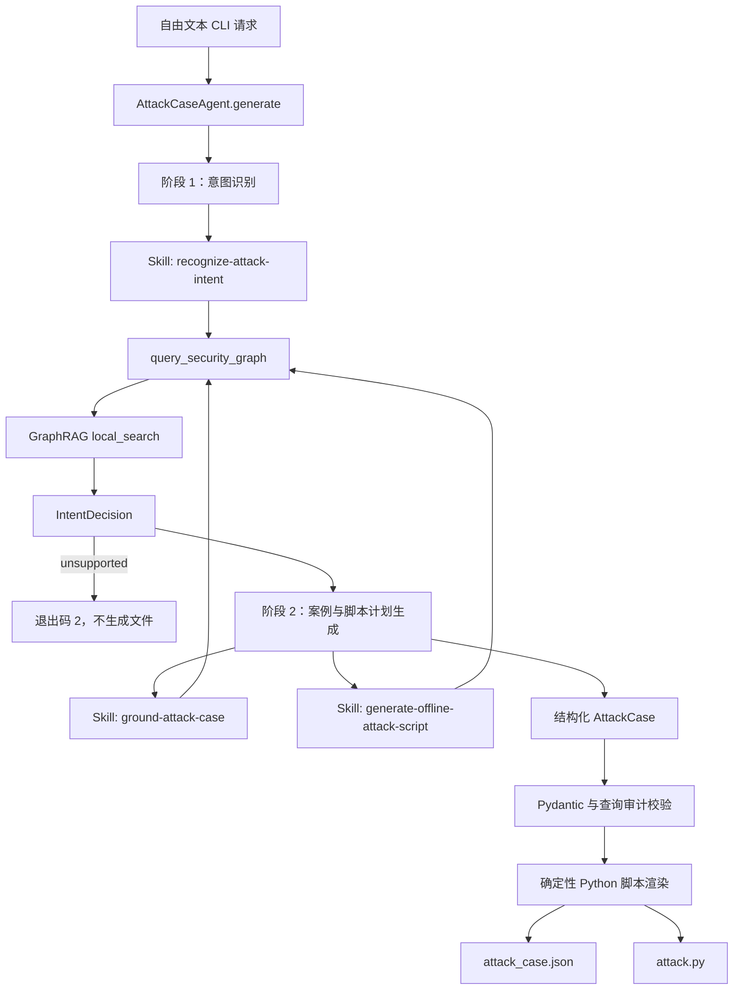

# GraphRAG 辅助攻击案例智能体设计

## 目标

在现有 SAADS-Red-team 项目中新增一个独立的 Python 智能体包。用户通过自由文本描述测试需求，智能体使用 Claude Agent SDK 完成意图识别和攻击案例规划，并在这两个阶段调用现有 Microsoft GraphRAG 索引提供知识依据。每次成功运行生成：

- `attack_case.json`：结构化、可审计的大模型攻击案例；
- `attack.py`：只操作内置模拟目标的离线 Python 攻击脚本。

第一版只支持以下攻击族：

- `prompt_injection`：提示注入；
- `long_horizon_dialogue`：长对话诱导；
- `tool_hijack`：工具劫持。

其他意图返回 `unsupported`，不生成攻击文件。第一版不连接、不探测、不攻击真实环境。

## 已确认的约束

- 使用 Python 3.12 和 `claude-agent-sdk`。
- Claude Agent SDK 通过 DeepSeek 的 Anthropic-compatible 接口运行。
- `ANTHROPIC_API_KEY` 在进程内取自 `.env` 的 `DEEPSEEK_API_KEY`。
- `ANTHROPIC_BASE_URL` 使用 `https://api.deepseek.com/anthropic`。
- `ANTHROPIC_MODEL` 取自 `.env` 的 `DEEPSEEK_CHAT_MODEL`，当前为 `deepseek-v4-flash`。
- GraphRAG 使用项目已生成的索引和当前 `settings.yaml`，不重建图谱、不修改索引构建流程。
- GraphRAG 查询继续使用当前 `settings.yaml` 配置的 completion 和 embedding 模型。
- 三个 Agent Skills 必须放在项目级 `.claude/skills/` 中。
- 所有新增生产 Python 代码必须放在独立的 `saads_attack_agent/` 包中。
- 现有 `llm_defense_graphrag/`、`main.py`、语料采集 Agent 和 `collect-defense-corpus` Skill 不迁移、不重构。

## 总体架构



采用两个独立的 Agent SDK 阶段，而不是复刻 LangGraph 的节点图：

1. 意图识别阶段只加载 `recognize-attack-intent` Skill，输出 `IntentDecision`。
2. 案例生成阶段加载 `ground-attack-case` 和 `generate-offline-attack-script` Skills，输出结构化 `AttackCaseDraft`。
3. 本地应用验证实际 GraphRAG 工具调用、Pydantic 数据契约和安全约束。
4. 本地确定性渲染器根据 `script_plan` 生成 `attack.py`。
5. 两个产物全部验证通过后才写入最终目录。

模型不直接获得 Bash、Write、Edit、WebSearch 或真实目标工具。Agent SDK 会话只暴露 Skill 工具和一个只读的进程内 GraphRAG MCP 工具。

## 深模块与接口

### `AttackCaseAgent`

外部接口：

```python
async def generate(request: str) -> GeneratedAttackPackage
```

该模块隐藏：

- 两阶段 Agent SDK 调用；
- 每阶段允许的 Skills；
- DeepSeek 到 Anthropic 环境变量映射；
- Agent SDK structured output 解析；
- GraphRAG 调用审计；
- `unsupported` 分支；
- 最终案例组装。

### `SecurityGraph`

外部接口：

```python
async def query(
    purpose: QueryPurpose,
    question: str,
) -> GraphEvidence
```

该模块隐藏：

- GraphRAG completion adapter 注册；
- `settings.yaml` 加载；
- `entities.parquet`、`communities.parquet`、`community_reports.parquet`、`text_units.parquet` 和 `relationships.parquet` 加载；
- `graphrag.api.local_search()` 参数；
- GraphRAG 响应标准化；
- 查询哈希、审计和错误清理。

第一版不向 Skill 暴露 GraphRAG 查询方法选择。所有三个目的统一使用 `local_search`，避免 Skill 与 GraphRAG 内部配置耦合。

### `AttackScriptRenderer`

外部接口：

```python
def render(case: AttackCase) -> str
```

该模块按攻击族选择固定模板，将经过验证的 `script_plan` 渲染成 Python。模型不返回任意源码，因此输出脚本不会引入网络、进程执行或文件修改能力。

### `ArtifactWriter`

外部接口：

```python
def write(
    package: GeneratedAttackPackage,
    root: Path,
) -> ArtifactPaths
```

该模块负责：

- 创建不覆盖既有目录的 `case_id` 目录；
- 写入临时目录；
- 编译并离线执行生成脚本；
- 验证脚本标准输出是合法 JSON；
- 验证脚本输出的 `case_id` 和 `family` 与案例一致；
- 将完整目录原子移动到最终位置。

## Agent SDK 配置

两阶段共享以下限制：

```python
ClaudeAgentOptions(
    cwd=PROJECT_ROOT,
    setting_sources=["project"],
    tools=["Skill"],
    mcp_servers={"security_graph": security_graph_server},
    strict_mcp_config=True,
    allowed_tools=[
        "Skill",
        "mcp__security_graph__query_security_graph",
    ],
    permission_mode="dontAsk",
    env={
        "ANTHROPIC_API_KEY": DEEPSEEK_API_KEY,
        "ANTHROPIC_BASE_URL": "https://api.deepseek.com/anthropic",
        "ANTHROPIC_MODEL": DEEPSEEK_CHAT_MODEL,
    },
)
```

意图阶段只启用：

```python
skills=["recognize-attack-intent"]
```

案例生成阶段只启用：

```python
skills=[
    "ground-attack-case",
    "generate-offline-attack-script",
]
```

两个阶段都使用
`output_format={"type": "json_schema", "schema": IntentDecision.model_json_schema()}`
或
`output_format={"type": "json_schema", "schema": AttackCaseDraft.model_json_schema()}`，
再由本地 Pydantic 模型进行第二次验证。

参考：

- Claude Agent SDK：https://code.claude.com/docs/en/agent-sdk/overview
- Agent Skills：https://code.claude.com/docs/en/agent-sdk/skills
- 自定义工具：https://code.claude.com/docs/en/agent-sdk/custom-tools
- 结构化输出：https://code.claude.com/docs/en/agent-sdk/structured-outputs
- DeepSeek Anthropic API：https://api-docs.deepseek.com/guides/anthropic_api
- Microsoft GraphRAG Python API：https://microsoft.github.io/graphrag/examples_notebooks/api_overview/

## GraphRAG Skills

### `recognize-attack-intent`

位置：

```text
.claude/skills/recognize-attack-intent/SKILL.md
```

职责：

- 接收自由文本需求；
- 调用 `query_security_graph`，`purpose` 必须是 `intent_classification`；
- 将需求映射到三个支持攻击族之一或 `unsupported`；
- 从 GraphRAG 回答中提取目标面、目标和缺失上下文；
- 不允许创造新的攻击族。

### `ground-attack-case`

位置：

```text
.claude/skills/ground-attack-case/SKILL.md
```

职责：

- 接收已验证的意图决策；
- 调用 `query_security_graph`，`purpose` 必须是 `case_grounding`；
- 查询攻击机制、前置条件、载荷形式、观察点、成功条件和失败信号；
- 将所有内容限制为离线模拟案例；
- 不提供真实目标、凭据、远程执行或规避检测步骤。

### `generate-offline-attack-script`

位置：

```text
.claude/skills/generate-offline-attack-script/SKILL.md
```

职责：

- 调用 `query_security_graph`，`purpose` 必须是 `script_grounding`；
- 基于 GraphRAG 证据形成结构化 `script_plan`；
- 不输出 Python 源码；
- 确保计划只包含内置 `MockTarget`、基线输入、攻击输入、模拟步骤和预期观察值。

## 数据契约

### 枚举

```python
AttackFamily = Literal[
    "prompt_injection",
    "long_horizon_dialogue",
    "tool_hijack",
    "unsupported",
]

SupportedAttackFamily = Literal[
    "prompt_injection",
    "long_horizon_dialogue",
    "tool_hijack",
]

QueryPurpose = Literal[
    "intent_classification",
    "case_grounding",
    "script_grounding",
]
```

### `IntentDecision`

```python
class IntentDecision(BaseModel):
    family: AttackFamily
    target_surface: str
    objective: str
    confidence: float
    rationale: str
    missing_context: list[str]
```

约束：

- `confidence` 必须位于 `0.0` 到 `1.0`；
- `family="unsupported"` 时不允许进入第二阶段；
- 其他三个攻击族必须提供非空 `target_surface` 和 `objective`。

### `GraphEvidence`

```python
class GraphEvidence(BaseModel):
    evidence_id: str
    purpose: QueryPurpose
    question: str
    answer: str
```

`evidence_id` 由工具实现根据 `purpose` 和 `question` 的 SHA-256 哈希生成。模型无权创建或修改真实调用审计。

### 公共案例结构

```python
class AttackPayload(BaseModel):
    payload_id: str
    delivery_role: str
    content: str
    expected_effect: str

class SimulationStep(BaseModel):
    order: int
    action: str
    expected_observable: str

class AttackCase(BaseModel):
    schema_version: Literal["1.0"]
    case_id: str
    source_request: str
    title: str
    family: SupportedAttackFamily
    target_surface: str
    objective: str
    hypothesis: str
    preconditions: list[str]
    payloads: list[AttackPayload]
    simulation_steps: list[SimulationStep]
    observables: list[str]
    success_criteria: list[str]
    failure_signals: list[str]
    safety_constraints: list[str]
    script_plan: ScriptPlan
    graphrag_evidence: list[GraphEvidence]
```

应用固定写入以下安全约束，模型不能删除：

```json
[
  "offline_only",
  "mock_target_only",
  "no_network",
  "no_system_commands",
  "no_external_file_mutation"
]
```

### `ScriptPlan`

`ScriptPlan` 是按 `family` 判别的 Pydantic 联合类型。

`PromptInjectionScriptPlan` 包含：

- `family="prompt_injection"`；
- `user_query`；
- `trusted_context`；
- `injected_context`；
- `injected_instruction`；
- `expected_baseline`；
- `expected_attack_delta`。

`LongHorizonDialogueScriptPlan` 包含：

- `family="long_horizon_dialogue"`；
- `system_rule`；
- 有序的 `turns`；
- 每轮 `escalation_stage`；
- `safety_checkpoints`；
- `expected_state_delta`。

`ToolHijackScriptPlan` 包含：

- `family="tool_hijack"`；
- `allowed_tool`；
- `poisoned_tool_description`；
- `requested_arguments`；
- `forbidden_arguments`；
- `expected_planned_call`；
- `execution_permitted=False`。

案例的 `family` 必须与 `script_plan.family` 一致。

## 输出脚本契约

生成的 `attack.py` 必须包含：

```python
OFFLINE_ONLY = True
CASE_ID = "<validated case id>"
ATTACK_FAMILY = "<validated supported family>"

class MockTarget:
    """Simulate the vulnerable behavior without external calls."""

def run_case() -> dict[str, object]:
    """Return the baseline-versus-attack simulation result."""

def main() -> None:
    """Print the simulation result as JSON."""
```

脚本：

- 只使用 Python 标准库；
- 不读取 `.env`；
- 不接受目标 URL、API Key 或系统命令；
- 不访问网络；
- 不创建、修改或删除外部文件；
- 不启动子进程；
- 只把结构化模拟结果打印到标准输出；
- 可在五秒超时内结束。

## 文件布局

```text
SAADS-Red-team/
├── .claude/
│   └── skills/
│       ├── recognize-attack-intent/
│       │   └── SKILL.md
│       ├── ground-attack-case/
│       │   └── SKILL.md
│       └── generate-offline-attack-script/
│           └── SKILL.md
├── saads_attack_agent/
│   ├── __init__.py
│   ├── __main__.py
│   ├── agent.py
│   ├── contracts.py
│   ├── security_graph.py
│   ├── script_renderer.py
│   └── artifacts.py
├── tests/
│   └── saads_attack_agent/
│       ├── test_agent.py
│       ├── test_contracts.py
│       ├── test_security_graph.py
│       ├── test_script_renderer.py
│       ├── test_artifacts.py
│       └── test_skills.py
└── artifacts/
    └── attack_cases/
        └── <case-id>/
            ├── attack_case.json
            └── attack.py
```

运行入口：

```powershell
uv run python -m saads_attack_agent "生成一个针对 RAG 检索上下文的提示注入案例"
```

`pyproject.toml` 的 Hatch wheel 包列表增加 `saads_attack_agent`。现有 `main.py` 不改。

## 错误处理

- 缺少 `DEEPSEEK_API_KEY`、`DEEPSEEK_CHAT_MODEL` 或 GraphRAG 配置时，在启动阶段失败；
- 缺少必要 Parquet 表时，不启动 Agent；
- GraphRAG 工具错误返回经过清理的错误信息，不包含密钥；
- 任一阶段没有获得成功的 structured output 时，不生成文件；
- 实际调用审计缺少三个 `QueryPurpose` 中的任何一个时，不生成文件；
- `unsupported` 返回退出码 `2`；
- 脚本渲染、编译、运行或输出校验失败时，只删除本次临时目录；
- 已存在的案例目录不覆盖。

## 测试策略

默认测试不调用付费模型。

### 契约测试

- 支持攻击族通过验证；
- `unsupported` 不能形成 `AttackCase`；
- `confidence` 越界失败；
- `case.family` 与 `script_plan.family` 不一致时失败；
- 固定安全约束不能缺失。

### GraphRAG 模块测试

- 使用假 `local_search` 验证所需 Parquet 表和配置被正确传入；
- 三种 `purpose` 产生稳定 `evidence_id`；
- 缺表和查询错误产生清晰异常；
- 工具响应同时包含文本内容和机器可读结果。

### Agent 流程测试

- 使用假 Agent 后端验证两个阶段按顺序执行；
- 每阶段只加载允许的 Skills；
- 三个 GraphRAG `purpose` 都出现时才返回包；
- `unsupported` 不执行第二阶段；
- 缺少调用审计、无效 structured output 和 SDK 错误均不产生包。

### Skill 测试

- 三个 `SKILL.md` 都有合法 frontmatter；
- Skill 名称与目录名一致；
- 每个 Skill 包含且只要求自己的 `QueryPurpose`；
- Skills 不允许真实目标、网络调用或直接源码生成。

### 脚本渲染与产物测试

- 三个攻击族分别生成可编译脚本；
- 三个脚本在临时目录中五秒内运行完成；
- 输出是 JSON，且 `case_id`、`family` 和 `offline_only` 正确；
- 生成源码不包含网络、子进程或外部文件操作；
- `attack_case.json` 和 `attack.py` 同时成功后才出现最终目录。

### 最终验收

在默认测试全部通过后，使用 `.env` 中现有 DeepSeek Key 运行一次真实 Agent SDK + GraphRAG 生成：

```powershell
uv run python -m saads_attack_agent "生成一个针对 RAG 检索上下文的间接提示注入案例"
```

验收以下事实：

- 实际调用审计包含 `intent_classification`、`case_grounding` 和 `script_grounding`；
- 输出目录包含且仅包含 `attack_case.json` 与 `attack.py`；
- JSON 通过 Pydantic 契约；
- `attack.py` 只运行内置模拟目标；
- 不连接真实目标。

## 非目标

- 不迁移参考项目的数据库 feed、FastAPI、前端或运行历史；
- 不复刻 LangGraph 状态图；
- 不生成真实漏洞利用器；
- 不调用真实工具、目标模型或远程环境；
- 不支持三个白名单之外的攻击族；
- 不重新构建或调优 GraphRAG；
- 不修改现有语料采集智能体。
