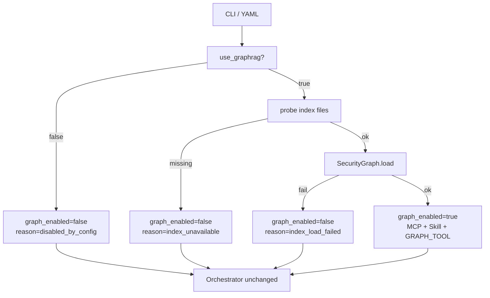

# Grill GraphRAG Skill 与可选知识接地设计

## 目标

增强 `saads_grill_agent`：在项目具备可用 GraphRAG 索引时，用项目级 Skill **软引导**红队与裁判更多地从安全知识图谱取证；在索引缺失或操作员显式关闭时，评估**照常运行且不报错**。

不改编排状态机；不改动 `saads_attack_agent` 的案例生成流水线（二者保持并列产品，仅继续共享 `SecurityGraph` 模块与 DeepSeek 环境映射）。

## 已确认的决策

| 决策 | 选择 |
|---|---|
| 范围 | 仅 `saads_grill_agent` + 新 Skill；Attack Agent 不动 |
| Skill 与 MCP | Skill 叠在现有 `query_security_graph` MCP 上（不取代 MCP） |
| 强制程度 | 软引导，不强制调用次数或证据门槛 |
| Skill 作用角色 | 红队、裁判；带图谱的子代理（`graph-grounder`、`test-strategist`）一并裁剪 |
| Skill 名称 | `ground-red-team-evidence` |
| 会话挂载 | 系统加载 Skill + 关键 turn prompt 点名 |
| 关闭方式 | YAML `use_graphrag`（默认 `true`）+ CLI `--no-graphrag` |
| 缺索引 | 探测后降级，不调用 `SecurityGraph.load`，不失败退出 |
| 启用策略 | 方案 1：探测后可选加载 |
| Grilling 思想 | 只小改角色提示词，不另做 Skill，不重写 discovery/debate 编排 |
| 有效开关 | `graph_enabled = use_graphrag AND graph_index_available` |

## 非目标

- 修改 `saads_attack_agent` 意图识别 / 案例 / 脚本生成行为
- 硬性要求每条假设必须带 GraphRAG 证据
- 为 Matt Pocock grilling 方法论重写状态机或新增方法论 Skill
- 引入 `graphrag: required|optional|off` 三态枚举
- 在 `cwd=target_repo` 且 `setting_sources=["project"]` 下加载**目标仓库** Skills（禁止）

## 现状问题

`saads_grill_agent.__main__.run_live_assessment` 无条件执行 `SecurityGraph.load(PROJECT_ROOT)`。缺少 `settings.yaml` 或任一必需 parquet 时抛出 `GraphConfigurationError`，导致无图谱环境无法跑 grill。

红队 / 裁判虽已具备 `mcp__security_graph__query_security_graph` 与 `graph-grounder` 子代理，但缺少项目 Skill 与 turn 级引导，图谱触发偏少。`TeamBackend` 使用 `cwd=target_repo`、`setting_sources=[]`，当前无法安全加载本仓库 Skills。

## 总体架构

```text
start/resume
  → 合并 RedTeamConfig（CLI > YAML > defaults）
  → AssessmentConfig.use_graphrag
  → run_live_assessment:
       if use_graphrag and probe(PROJECT_ROOT):
           load SecurityGraph → graph_enabled=true
           mcp += security_graph
       else:
           graph_enabled=false（记 skipped_reason）
           不 load、不挂 security_graph
  → TeamBackend(graph_enabled, cwd=PROJECT_ROOT, …)
  → 既有 AssessmentOrchestrator 阶段不变
```



## 配置

### YAML（`RedTeamConfig` / `red-team-config.yaml`）

```yaml
# --- knowledge grounding ----------------------------------------------------
# Soft GraphRAG assist for red_team / judge (and graph-capable subagents).
# Default true. Set false, or pass --no-graphrag, to run repo-only.
# If the project index is missing, grill still runs (graph stays off).
use_graphrag: true
```

### CLI

- `start` 与 `resume` 支持 `--no-graphrag`（`store_true`）→ 强制 `use_graphrag=false`
- 不提供命令行「重新打开」flag；要启用则改 YAML 或去掉该 flag

### 优先级

`CLI > YAML > 默认值(true)`，经现有 `merge_cli_over_config` 扩展合并。

### `AssessmentConfig`

新增字段：

```python
use_graphrag: bool = True
```

经 `to_assessment_config` 写入，进入 `run_state.json`；resume 沿用该布尔值。resume 再次传入 `--no-graphrag` 时可盖成 `false`（与费用上限覆盖一致）。

### Resolved 快照

`red-team-config.resolved.yaml`（及可选 run metadata）增加运行时字段：

| 字段 | 含义 |
|---|---|
| `use_graphrag` | 操作员意图（合并后） |
| `graph_enabled` | 本跑是否实际挂载图谱 |
| `graph_skipped_reason` | `null` / `disabled_by_config` / `index_unavailable` / `index_load_failed` |

`graph_index_available` 在每次 live `start`/`resume` 时重新探测：索引后来就绪且 `use_graphrag` 仍为 true 时，本次可启用图谱。

## 探测与加载（方案 1）

探测根目录为 SAADS `PROJECT_ROOT`（与今日 `SecurityGraph.load` 一致），检查：

- `settings.yaml` 存在
- `output/{entities,communities,community_reports,text_units,relationships}.parquet` 均存在

仅当 `use_graphrag and probe_ok` 时调用 `SecurityGraph.load`。探测失败不抛给 CLI 用户为失败；`load` 异常则降级为 `index_load_failed`，评估继续。

可选：stderr 一行信息（如 `GraphRAG disabled: index_unavailable`），不改变退出码。

## Skill：`ground-red-team-evidence`

路径：`.claude/skills/ground-red-team-evidence/SKILL.md`

### 职责

教红队 / 裁判（及图谱子代理）何时、用哪个 purpose、如何引用 `query_security_graph`；强调可选、不凑数。不承载 grilling 方法论全文。

### 内容要点

1. 适用时机：提出/修订假设、辩论站队、裁决取证、测试策略需要机制背景时
2. Purpose 映射（与现有契约一致）：
   - `threat_modeling`
   - `hypothesis_grounding`
   - `adjudication_grounding`
   - `test_grounding`
3. 工具：`mcp__security_graph__query_security_graph`；问题绑定当前 surface / 假设
4. 引用：将 `evidence_id` 写入 `graph_evidence_ids` 等契约字段
5. 非必须：仓库证据已够可跳过；禁止空问凑数
6. 边界：只读图谱；不碰真目标、不执行攻击

## 会话加载与安全

### 约束

目标仓库视为不可信：不得加载其 Skills / hooks / MCP 作为指令。

因此禁止：`cwd=target_repo` + `setting_sources=["project"]`（会发现目标侧 `.claude/skills/`）。

### `graph_enabled=true` 时

| 选项 | 值 |
|---|---|
| `cwd` | SAADS `PROJECT_ROOT` |
| `setting_sources` | `["project"]` |
| `skills` | `["ground-red-team-evidence"]` |
| `allowed_tools` | 角色原有工具 + `"Skill"`；红队/裁判保留 `GRAPH_TOOL` |
| 仓库访问 | 仅只读 `repository` MCP |

### `graph_enabled=false` 时

- 不挂 `security_graph` MCP，不调用 `SecurityGraph.load`
- 不启用 Skill / `"Skill"` 工具
- 红队/裁判 `allowed_tools` 去掉 `GRAPH_TOOL`
- 不注册 `graph-grounder`；`test-strategist` 仅仓库工具
- 代码队始终仅仓库工具（与今日一致）

### cwd 统一

实现时 **无论是否启用图谱**，SDK 会话 `cwd` 统一为 `PROJECT_ROOT`，仓库一律经 MCP 访问，避免分叉与误加载目标设置。

`TeamBackend` 接收 `project_root`、`graph_enabled`（及 MCP 组装结果），在 `_role_tools` / `_role_agents` / `_build_options` 处分叉。

## 提示词小改（含 grilling）

编排（discovery 循环、辩论轮次、收敛条件、假设上限）**不改**。仅增补 turn prompt 短句。

### Grilling（各角色 2～4 句量级）

| 角色 / 阶段 | 要点 |
|---|---|
| 红队 discovery | 一次少量可证伪分支；先查事实再提假设；每条带最可能攻击角；证据不足则少提或空列表 |
| 红队 debate | 只咬当前假设；站队必须挂已签发 `evidence_id`；可推荐修正，未裁决不定论 |
| 裁判 | 先核证据；收敛前可 `request_more_evidence`；终局才 confirm/reject/duplicate |
| 测试草稿 | 仅已确认 finding（编排已保证，prompt 再点一句） |
| 代码队 | 不提图谱；可点「用仓库证据证伪，一次针对当前假设」 |

### GraphRAG 软引导（仅 `graph_enabled`）

在 discovery、红队回应、裁判裁决及相关子代理 prompt 中追加一句：需要机制/控制/同类模式背景时可先用 `$ground-red-team-evidence`；非必须。

`graph_enabled=false` 时不出现 GraphRAG / 该 Skill 字样。

### 子代理

`graph-grounder` 仅在 `graph_enabled` 时注册；其 prompt 要求遵循本 Skill 的 purpose 规范。

## 工具裁剪清单

| 组件 | `graph_enabled=true` | `graph_enabled=false` |
|---|---|---|
| MCP `security_graph` | 挂载 | 不挂载 |
| `SecurityGraph.load` | 探测通过后加载 | 不调用 |
| 红队 / 裁判 `GRAPH_TOOL` | 保留 | 移除 |
| Skill `ground-red-team-evidence` | 启用 | 不启用 |
| `graph-grounder` | 注册 | 不注册 |
| `test-strategist` | 可带图谱工具 | 仅仓库工具 |
| 代码队 | 仅仓库 | 仅仓库 |
| `cwd` | `PROJECT_ROOT` | `PROJECT_ROOT` |

## 错误处理与可见性

| 情况 | 行为 |
|---|---|
| 配置关闭 | 降级，`disabled_by_config`，评估继续 |
| 索引不齐 | 不 load，`index_unavailable`，评估继续；不以 GraphRAG 配置错误退出 |
| load 失败 | 降级，`index_load_failed`，评估继续 |
| 单次图谱查询失败 | 不中断 assessment；模型可改用仓库证据 |
| 非法仓库路径 / 缺授权等 | 仍按现有 CLI 用法错误处理 |

可见性：

1. `red-team-config.resolved.yaml` 含上述三字段
2. `report.md` 开头增加「知识接地」小节：是否启用及跳过原因
3. 可选 ledger 事件 `graphrag_status`（实现成本低则加）

Finding 中已有 GraphRAG 证据列表字段，保持；未启用时预期多为空。

## 文档更新（实现期）

- 根目录 `red-team-config.yaml` 增加 `use_graphrag` 与注释
- README grill 小节：可选 GraphRAG Skill、`--no-graphrag`、无索引自动降级
- 不改 Attack Agent 主文档路径；必要时一句澄清二者并列

## 测试计划

1. **配置**：默认 `true`；YAML `false`；`--no-graphrag` 覆盖 YAML `true`；resume 可再盖关
2. **探测**：缺表/缺 settings → unavailable；齐全 → available
3. **门闩（mock TeamBackend）**：`false` 时无 `security_graph` MCP、无 `GRAPH_TOOL`/`Skill`、无 `graph-grounder`；`true` 时相反且 skills 含 `ground-red-team-evidence`
4. **CLI**：无索引 fixture 下 start 不因 GraphRAG 以 exit 1 失败
5. **Skill 文件**：存在且 frontmatter `name: ground-red-team-evidence`
6. **回归**：现有 `tests/saads_grill_agent` 在开/关路径下通过

## 实现触及面（预期）

- `saads_grill_agent/runtime_config.py` — `use_graphrag`、merge
- `saads_grill_agent/contracts.py` — `AssessmentConfig.use_graphrag`
- `saads_grill_agent/__main__.py` — `--no-graphrag`、probe/load 门闩、resolved 字段
- `saads_grill_agent/teams.py` — cwd、skills、工具/子代理裁剪
- `saads_grill_agent/orchestrator.py` — turn prompt 小改（接受 `graph_enabled`）
- `saads_grill_agent/report.py` — 知识接地摘要
- 可选：`saads_attack_agent/security_graph.py` 或 grill 侧薄封装 `probe_graph_index`（优先放 grill 包，避免扩 Attack Agent 职责）
- `.claude/skills/ground-red-team-evidence/SKILL.md`
- `red-team-config.yaml`、README
- 对应 pytest

## 成功标准

1. 无 GraphRAG 索引时，`python -m saads_grill_agent start …` 能完成（或按原有非图谱原因失败），不因缺 parquet 退出
2. `--no-graphrag` / `use_graphrag: false` 时会话无图谱 MCP 与该 Skill
3. 有索引且未关闭时，红队/裁判可调用 Skill + `query_security_graph`，prompt 含软引导
4. 编排行为（空扫收敛、辩论轮次、确认后才出测试草稿）与改前一致
5. 上述测试通过
